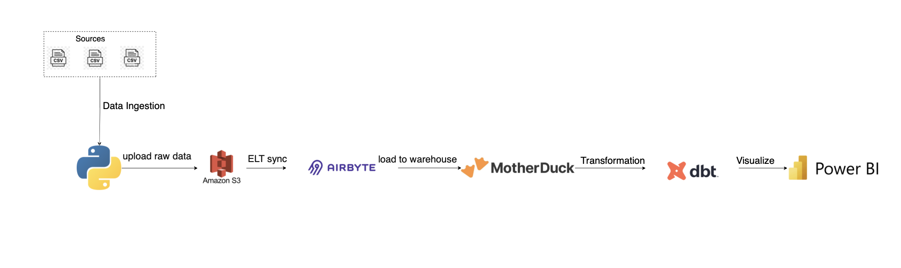
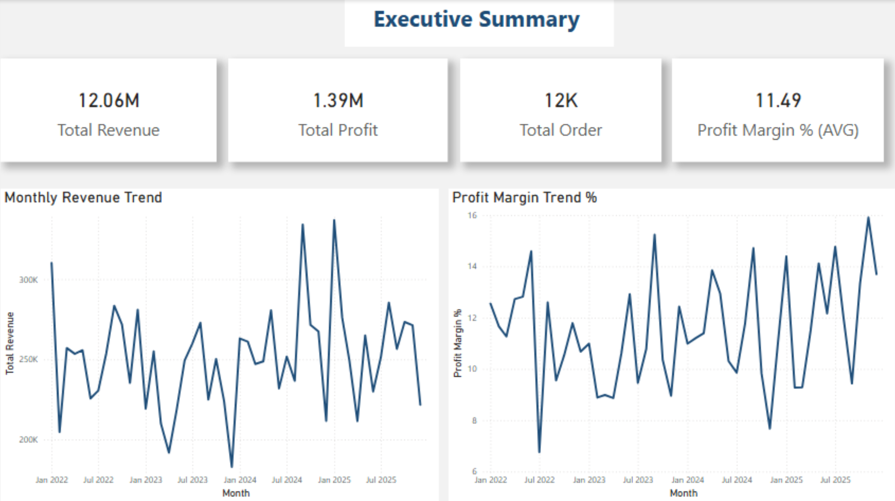
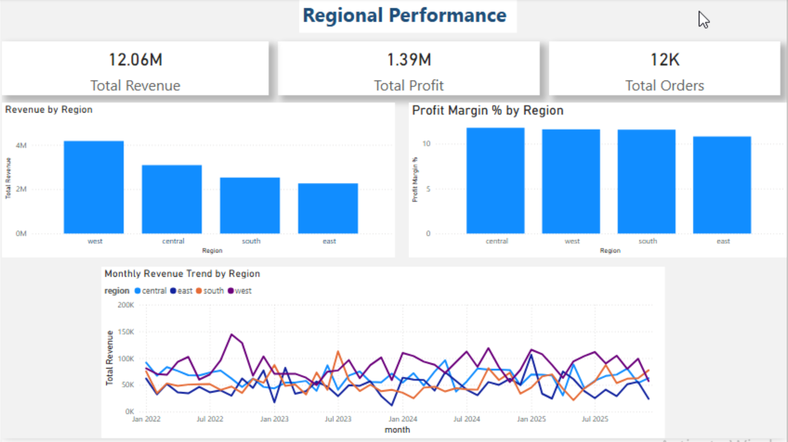
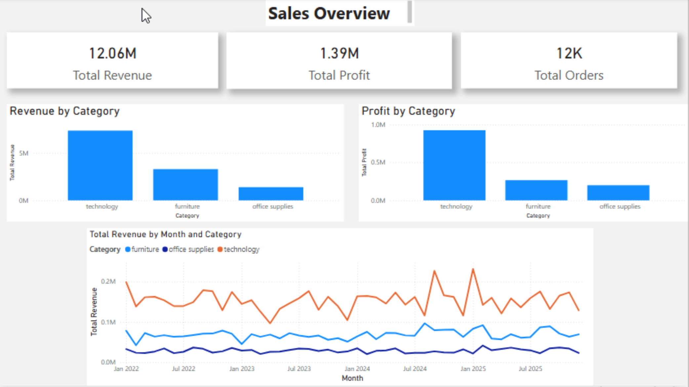
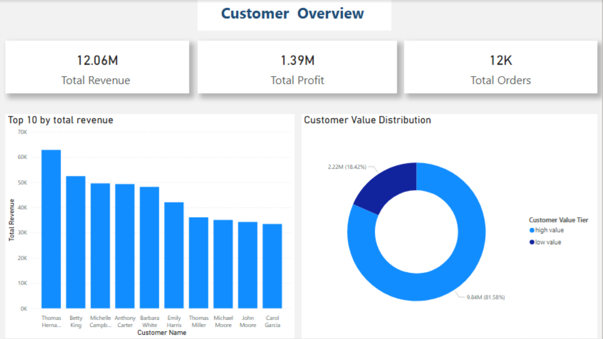

# Retailio ELT Pipeline

## Background

Retailio is a multi-branch US retailer whose data management had become fragmented as operations expanded. Each branch exported daily reports manually and shared updates through emails and spreadsheets, introducing delays, errors and inconsistency across datasets. This project builds a fully automated ELT pipeline that centralises branch data, applies structured transformations and delivers real-time business intelligence to management through a Power BI dashboard.

## Overview

This project implements an end-to-end ELT pipeline for retail analytics. A Python script uploads branch-level CSV files to Amazon S3, which Airbyte ingests and syncs into staging schemas in MotherDuck on a 24-hour schedule. dbt then transforms the raw data through three modelling layers — staging, intermediate and marts — applying 43 automated data quality tests throughout. Power BI connects directly to MotherDuck mart tables for near-real-time or scheduled reporting across four management views: Executive Summary, Regional Performance, Sales Overview and Customer Overview.

## Data Pipeline Architecture



## Tech Stack

| Component | Technology | Purpose |
|---|---|---|
| Ingestion Script | Python (boto3) | Uploads branch CSV files to S3 |
| Data Lake | Amazon S3 | Centralised raw file storage |
| Data Ingestion | Airbyte | Automated 24hr sync from S3 to MotherDuck |
| Data Warehouse | MotherDuck (DuckDB) | Cloud analytical warehouse |
| Transformation | dbt (dbt-duckdb) | Layered modelling, testing and documentation |
| Visualisation | Power BI | Management dashboard |

## Project Setup Guide

### Prerequisites

- Python 3.12+
- AWS account with S3 bucket
- Airbyte instance with S3 source and MotherDuck destination configured
- MotherDuck account and access token
- dbt-duckdb installed

### Step 1: Clone the Repository

```bash
git clone https://github.com/yourusername/retailio-elt-pipeline.git
cd retailio-elt-pipeline
```

### Step 2: Install Dependencies

```bash
pip install -r requirements.txt
```

### Step 3: Configure Environment Variables

```bash
export motherduck_token="your_motherduck_token"
export AWS_ACCESS_KEY_ID="your_aws_access_key"
export AWS_SECRET_ACCESS_KEY="your_aws_secret_key"
export AWS_DEFAULT_REGION="your_aws_region"
```


> **Note:** The MotherDuck token must be set as an environment variable. It cannot be passed inside `profiles.yml`. MotherDuck requires the token to be available before the connection initialises.

### Step 4: Upload CSV Files to S3

```bash
python scripts/upload_to_s3.py
```

### Step 5: Run Airbyte Sync

Trigger manually from the Airbyte UI or wait for the automated 24-hour sync. Airbyte loads raw tables into MotherDuck automatically.

### Step 6: Configure dbt Connection

Ensure `~/.dbt/profiles.yml` is configured:

```yaml
retailio_dbt:
  target: dev
  outputs:
    dev:
      type: duckdb
      path: md:Retailio_database
```

### Step 7: Run dbt

```bash
cd dbt/retailio_dbt
dbt build
```

`dbt build` runs all 8 models and all 43 tests in one command in dependency order.

### Step 8: Connect Power BI

1. Open Power BI Desktop
2. Select **Get Data → PostgresSQL database**
3. Use the MotherDuck postgres driver with connection string:
```
server=your_postgres_host; Database=md:Retailio_database; motherduck_token=your_token; data_connectivity_mode=DirectQuery
```
> **Note:** You can find your_postgres_host at MotherDuck Postgres settings.
4. Select the four mart tables and load

## Dashboard Preview

### Executive Summary


### Regional Performance


### Sales Overview


### Customer Overview


The dashboard includes four pages:

- **Executive Summary** — Monthly KPIs: total revenue (£12.06M), total profit (£1.39M), total orders (12K), average profit margin (11.49%), monthly revenue and profit margin trend lines
- **Regional Performance** — Revenue and profit margin by region, monthly revenue trend broken down by region
- **Sales Overview** — Revenue and profit by product category, monthly revenue trend by category
- **Customer Overview** — Top 10 customers by revenue, high vs low value customer distribution (81.58% of revenue from high value customers)

## Data Flow

```
Branch CSV Files
       │
       ▼
  upload_to_s3.py  ──────────────►  Amazon S3 (raw CSV storage)
                                            │
                                            ▼
                                    Airbyte (24hr sync)
                                            │
                                            ▼
                               MotherDuck — raw tables
                               ┌────────────────────────┐
                               │  customers             │
                               │  products              │
                               │  sales                 │
                               └────────────┬───────────┘
                                            │
                                            ▼
                               dbt — staging layer
                               ┌────────────────────────┐
                               │  stg_customers         │
                               │  stg_products          │
                               │  stg_sales             │
                               └────────────┬───────────┘
                                            │
                                            ▼
                               dbt — intermediate layer
                               ┌────────────────────────┐
                               │  int_sales_enriched    │
                               └────────────┬───────────┘
                                            │
                                            ▼
                               dbt — marts layer
                               ┌────────────────────────┐
                               │  mart_executive_summary│
                               │  mart_regional_perf    │
                               │  mart_sales_overview   │
                               │  mart_customer_overview│
                               └────────────┬───────────┘
                                            │
                                            ▼
                                        Power BI
```

## dbt Model Documentation

### Staging Layer

One model per raw source table. Cleans, renames and casts only — no joins or business logic.

| Model | Source | Key Transformations |
|---|---|---|
| `stg_customers` | `customers` | Lowercase email, trim whitespace, cast `date_of_birth` to DATE, rename `name` → `customer_name`, drop Airbyte metadata |
| `stg_products` | `products` | Cast `price` to DECIMAL(10,2), cast `stock_quantity` to INTEGER, cast `product_ratings` to DECIMAL(3,1) |
| `stg_sales` | `sales` | Rename `sales` → `sales_amount`, cast dates to DATE, filter `sales > 0` |

> **Known issue:** `product_id` in the sales dataset uses a category-based format (`T-C-0134`) while the products dataset uses sequential IDs (`P000001`). These were created by different teams independently and cannot be reliably joined. `stg_products` is staged independently and this has been flagged for resolution.

### Intermediate Layer

| Model | Sources | Join | Purpose |
|---|---|---|---|
| `int_enriched_sales` | `stg_sales` + `stg_customers` | LEFT JOIN on `customer_id` | Enriches each sale with customer details |

LEFT JOIN used to preserve all sales records — INNER JOIN would silently drop sales where `customer_id` has no match in the customers table.

### Marts Layer

| Model | Grain | Purpose |
|---|---|---|
| `mart_executive_summary` | One row per month | Monthly business KPIs for management |
| `mart_regional_performance` | One row per month, region, category | Regional branch performance comparison |
| `mart_sales_overview` | One row per month, region, category | Sales performance by product category |
| `mart_customer_overview` | One row per customer, region, category | Customer value classification and ranking |

All models use `{{ ref() }}` for dependency management. dbt builds models in correct order automatically.

## Data Quality Testing

43 automated tests run on every `dbt build` execution across all three layers.

| Layer | Tests | What They Catch |
|---|---|---|
| Staging | 21 | Duplicate IDs, null values, invalid regions/segments, referential integrity |
| Intermediate | 8 | Null metrics after join, duplicate order IDs |
| Marts | 14 | Null business metrics, invalid customer tiers, duplicate months |
| **Total** | **43** | |

```bash
dbt build

Finished running 43 data tests, 8 view models in 15.13 seconds
Done. PASS=51  WARN=0  ERROR=0  SKIP=0  TOTAL=51
```

Example test configuration:

```yaml
- name: order_id
  tests:
    - unique
    - not_null

- name: region
  tests:
    - accepted_values:
        values: ['west', 'east', 'south', 'central']

- name: customer_id
  tests:
    - relationships:
        to: ref('stg_customers')
        field: customer_id
```

## Key Results & Outcomes

- Multi-year retail sales dataset (2022–2025) processed across 4 US regions, replacing fragmented branch-level reporting with a centralised analytics system
- End-to-end manual reporting eliminated, reducing multi-step spreadsheet workflows into a fully automated daily ELT pipeline
- 43 dbt data quality tests enforced across all layers with 0 failures in production runs, improving trust in reporting outputs
- Identified that 81.58% of £12.06M revenue originates from high-value customers, enabling more targeted business segmentation
- 4 regional data sources unified into a single analytical warehouse for the first time, enabling cross-region performance comparison
- Introduced consistent profit margin tracking, previously unavailable due to inconsistent branch reporting formats
- Built a layered analytics architecture (staging → intermediate → marts) replacing inconsistent ad hoc spreadsheet-based reporting workflows

## Choice of Tools

**Python (boto3)**
AWS SDK used for automating S3 ingestion.
- Automates first-stage data upload (removes manual intervention)
- Handles retries, multipart uploads and credentials natively
- Standard industry tool for AWS-based ingestion scripts
 
**Amazon S3**
Raw data lake for all branch CSV files.
- Centralised and cloud-accessible storage layer
- Scales indefinitely without infrastructure management
- Native integration with Airbyte as a source connector
 
**Airbyte**
Managed ingestion layer from S3 to MotherDuck.
- No-code pipeline reduces engineering overhead
- Built-in schema detection and incremental sync
- Removes need for a custom ingestion script
 
**MotherDuck**
Analytical warehouse for transformed data.
- Lightweight DuckDB-based cloud warehouse
- Cost-efficient compared to Snowflake or BigQuery at this scale
- Seamless dbt integration via dbt-duckdb adapter
 
**dbt**
Transformation and testing framework.
- Enables modular SQL transformations (staging → intermediate → marts)
- Adds version control, dependency management and documentation
- 43 automated data quality tests run on every build
 
**Power BI**
Business intelligence layer for dashboards.
- Most widely used BI tool in UK enterprise retail environments
- Direct ODBC connection to MotherDuck — no intermediate export steps
- Fast drag-and-drop dashboard development for business users

## Data Dictionary

| Column | Table | Type | Description |
|---|---|---|---|
| `customer_id` | stg_customers | VARCHAR | Unique customer identifier (e.g. CUST-00020) |
| `customer_name` | stg_customers | VARCHAR | Full customer name, trimmed |
| `email` | stg_customers | VARCHAR | Lowercase customer email |
| `gender` | stg_customers | VARCHAR | Customer gender: female, male, non-binary |
| `date_of_birth` | stg_customers | DATE | Customer date of birth |
| `product_id` | stg_products | VARCHAR | Unique product identifier (e.g. P000001) |
| `product_name` | stg_products | VARCHAR | Product name, trimmed |
| `product_category` | stg_products | VARCHAR | Product category in lowercase |
| `price` | stg_products | DECIMAL(10,2) | Product price |
| `product_ratings` | stg_products | DECIMAL(3,1) | Product rating out of 5 |
| `order_id` | stg_sales | VARCHAR | Unique order identifier (e.g. ORD-2022-000013) |
| `sales_amount` | stg_sales | DECIMAL(10,2) | Total order value |
| `profit` | stg_sales | DECIMAL(10,2) | Profit on the order (can be negative) |
| `discount` | stg_sales | DECIMAL(4,2) | Discount applied as decimal (0.15 = 15%) |
| `region` | stg_sales | VARCHAR | Sales region: west, east, south, central |
| `customer_segment` | stg_sales | VARCHAR | Segment: consumer, corporate, home office |
| `order_date` | stg_sales | DATE | Date the order was placed |
| `ship_date` | stg_sales | DATE | Date the order was shipped |
| `customer_value_tier` | mart_customer_overview | VARCHAR | high value or low value based on revenue vs average |

## Project Dependencies

### Python Packages

| Package | Purpose |
|---|---|
| `boto3` | AWS SDK for S3 uploads |
| `dbt-duckdb` | dbt adapter for DuckDB and MotherDuck |

### dbt Versions

| Tool | Version |
|---|---|
| dbt | 1.11.7 |
| dbt-duckdb | 1.10.1 |
| duckdb | 1.5.1 |

## Project Structure

```
retailio-elt-pipeline/
├── scripts/
│   └── main.py
|   └── config.py
|   └── ingest.py
├── dbt/
│   └── retailio_dbt/
│       ├── models/
│       │   ├── staging/
│       │   │   ├── stg_customers.sql
│       │   │   ├── stg_products.sql
│       │   │   ├── stg_sales.sql
│       │   │   └── schema.yml
│       │   ├── intermediate/
│       │   │   ├── int_enriched_sales.sql
│       │   │   └── schema.yml
│       │   └── marts/
│       │       ├── mart_executive_summary.sql
│       │       ├── mart_regional_performance.sql
│       │       ├── mart_sales_overview.sql
│       │       ├── mart_customer_overview.sql
│       │       └── schema.yml
│       └── dbt_project.yml
├── dashboard/
│   ├── architecture.png
│   ├── executive_summary.png
│   ├── regional_performance.png
│   ├── sales_overview.png
│   └── customer_overview.png
├── .gitignore
├── requirements.txt
└── README.md
```

## Troubleshooting

### dbt cannot connect to MotherDuck

Ensure `motherduck_token` is set as an environment variable before running dbt:

```bash
export motherduck_token="your_token"
dbt debug
```

The connection details in `dbt debug` output should show `path: md:Retailio_database` and `Connection test: OK`.

### dbt test failures on `accepted_values` for region or segment

Verify that your staging models are applying `LOWER()` to the region and segment columns. The accepted values in `schema.yml` are lowercase. If raw data contains mixed casing, the test will fail without the `LOWER()` transformation.

### Power BI showing incorrect aggregations

Check the aggregation type on each field in the Fields well. Power BI may default to Average for pre-aggregated columns. Metric columns like `total_revenue` and `total_profit` should use Sum. Ratio columns like `profit_margin_pct` should use Average.

### Months sorting alphabetically instead of chronologically

Ensure the X axis is set to the `month` column (DATE_TRUNC output) not `month_name` (formatted string). Use `month` for sort order and `month_name` for display labels.

## Production Enhancements & Scalability

| Improvement | Description |
|---|---|
| Airbyte dbt integration | Trigger dbt automatically after each Airbyte sync |
| Airflow orchestration | Schedule and monitor the full pipeline end to end |
| Product ID standardisation | Resolve incompatible ID formats to enable sales-product joins |
| Incremental models | Convert marts to incremental materialisation for scale |
| GitHub Actions CI/CD | Run dbt tests automatically on every pull request |
| dbt source freshness | Alert when source data has not refreshed within expected window |

## Additional Resources

- [dbt Documentation](https://docs.getdbt.com)
- [MotherDuck Documentation](https://motherduck.com/docs)
- [Airbyte Documentation](https://docs.airbyte.com)
- [dbt-duckdb Adapter](https://github.com/duckdb/dbt-duckdb)
- [Power BI Motherduck Connector](https://motherduck.com/docs/integrations/bi-tools/powerbi/)